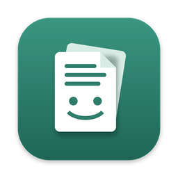
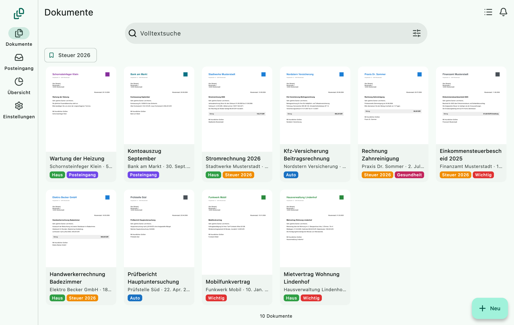
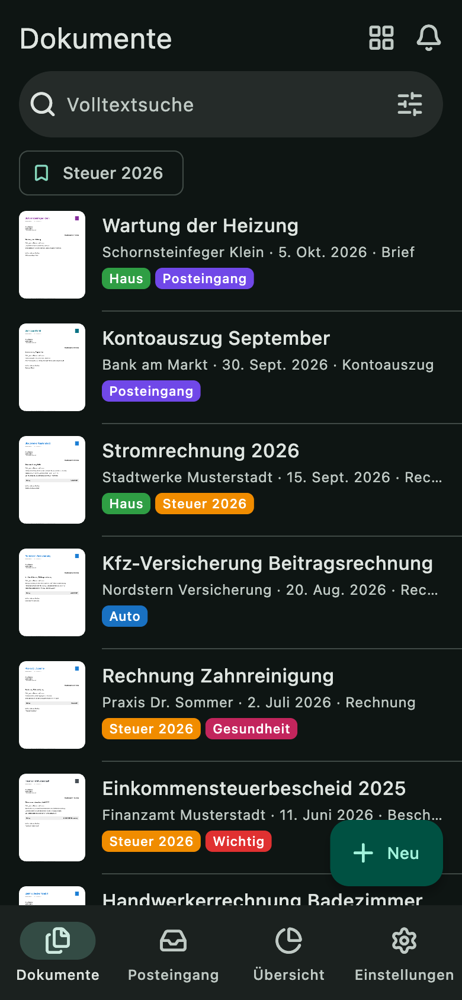
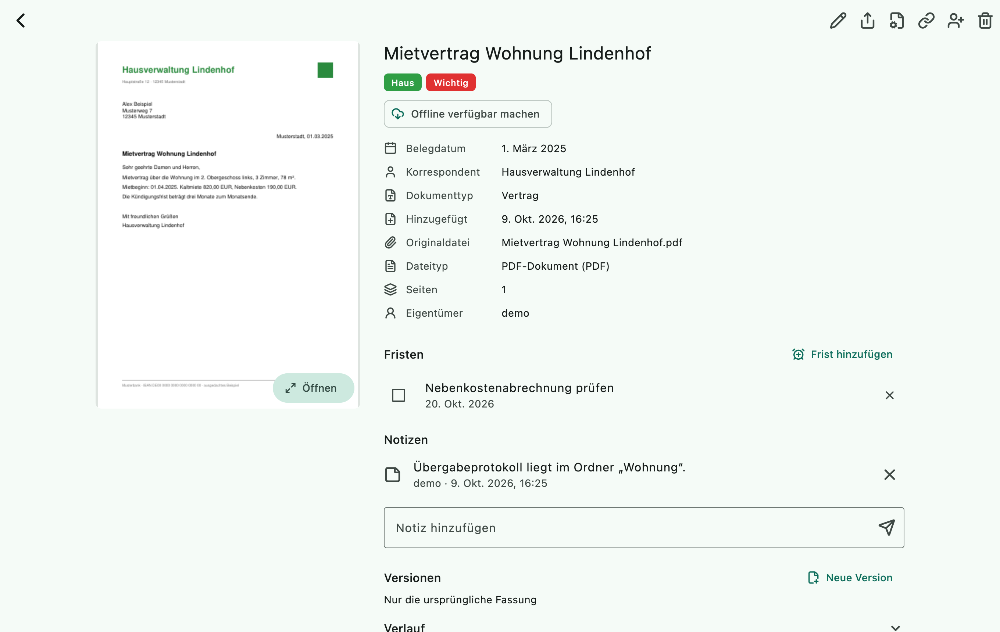
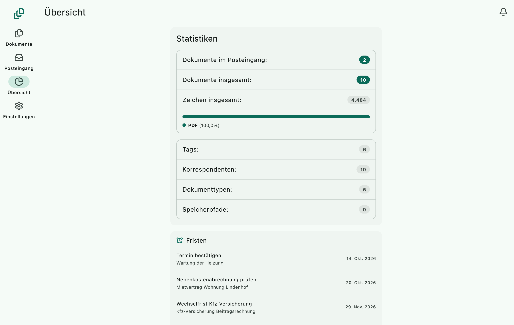

# PaperBuddy

<p align="center">
  
</p>

<p align="center">
  Dokumente scannen, durchsuchbar machen, ordnen und Fristen im Blick
  behalten – auf dem eigenen Server, kompatibel zu Paperless-ngx.
</p>

PaperBuddy ist eine selbst gehostete Dokumentenverwaltung in Dart und
Flutter, inspiriert von Paperless-ngx. Der Server übernimmt Dokumente aus der
App, per E-Mail, aus einem Eingangsordner oder direkt vom Netzwerkscanner,
erkennt den Text per OCR und ordnet sie Korrespondenten, Dokumenttypen und
Tags zu. Er spricht die **REST-API von Paperless-ngx**, dadurch funktionieren
auch vorhandene Apps wie Swift Paperless (iOS) oder Paperless Mobile direkt.
Die eigene App gibt es für Android, iOS, macOS, Windows, Linux und den Browser.

Der Quellcode ist einsehbar, aber **nicht Open Source**: Der Projektcode
steht unter der [PolyForm Strict License 1.0.0](LICENSE) (© 2026 Dasevo
Digital und superkuh). Erlaubt sind die nichtkommerzielle Nutzung und das
Prüfen des Quellcodes. Kopieren, Ändern, Weitergeben und jede kommerzielle
Nutzung sind ohne gesonderte schriftliche Genehmigung nicht gestattet.
Hinweise zu Komponenten und Diensten Dritter stehen in
[THIRD_PARTY_NOTICES.md](THIRD_PARTY_NOTICES.md).

## Ein Blick in PaperBuddy

<p align="center">
  
  
</p>
<p align="center">
  
  
</p>

*Die Screenshots zeigen ausgedachte Demo-Dokumente (`app/tool/screenshots.sh`).*

## Herunterladen

Die fertigen Apps und das Server-Paket liegen bei den
[Releases](../../releases/latest):

| Datei | Für |
|---|---|
| `PaperBuddy-<version>-android.apk` | Android 7 und neuer |
| `PaperBuddy-<version>-macos.zip` | macOS 12 und neuer, Apple Silicon und Intel |
| `PaperBuddy-<version>-server-linux-<arch>.tar.gz` | Server ohne Docker für x64 und arm64, siehe [unten](#debianubuntu-ohne-docker-z-b-proxmox-lxc) |

Die Builds sind nicht von Apple beglaubigt. macOS öffnet die App beim ersten
Mal nur über Rechtsklick → *Öffnen*. Für iPhone, iPad, Windows und Linux gibt
es noch keinen Download; dort lässt sich die App mit Flutter aus dem
Quellcode bauen. `SHA256SUMS.txt` im Release enthält die Prüfsummen aller
Dateien.

## Aufbau

| Ordner | Inhalt |
|---|---|
| `server/` | Dart-Server: API, Verarbeitung (OCR), Eingangsordner, SQLite |
| `app/` | Flutter-Client für iOS, Android, macOS, Windows, Linux und Web |
| `packages/paperbuddy_api/` | Gemeinsamer API-Client und Modelle (reines Dart) |
| `docs/` | Architektur und Roadmap |

## Server starten

### Nativ (macOS/Linux/Windows)

```bash
cd server
dart pub get
PAPERBUDDY_ADMIN_USER=admin PAPERBUDDY_ADMIN_PASSWORD=geheim123 \
PAPERBUDDY_CONSUMPTION_DIR=./consume dart run bin/server.dart
```

Für OCR und Vorschaubilder werden `ocrmypdf`, `tesseract` und `poppler` benötigt
(macOS: `brew install ocrmypdf tesseract-lang poppler`). Ohne sie werden Dateien
trotzdem übernommen, nur ohne Texterkennung.

Als eigenständige Binary samt SQLite: `dart build cli -t bin/server.dart` →
`build/cli/<plattform>/bundle/`.

### Docker (NAS/Server)

```bash
cp .env.example .env   # Passwörter setzen
docker compose up -d
```

Startet den Server auf Port 8000 und optional eine SMB-Freigabe `\\<host>\scans`
für Netzwerkscanner.

### Debian/Ubuntu ohne Docker (z. B. Proxmox-LXC)

```bash
deploy/lxc/build_bundle.sh          # build/lxc/paperbuddy-server-<version>-linux-x64.tar.gz (ARCH=arm64 für ARM)
scp build/lxc/paperbuddy-server-*.tar.gz root@<server>:/root/
ssh root@<server> 'sh -c "tar xzf paperbuddy-server-*.tar.gz && sh paperbuddy-server-*/install.sh"'
```

`install.sh` installiert OCR-Werkzeuge, legt den Dienst `paperbuddy` (systemd)
an und startet ihn auf Port 8000. Daten liegen in `/var/lib/paperbuddy`, der
Eingangsordner in `/var/lib/paperbuddy/consume`, die Konfiguration in
`/etc/paperbuddy/paperbuddy.env`. Beim ersten Lauf wird ein Administrator mit
Zufallspasswort angelegt (`/root/paperbuddy-admin.txt`). Ein erneuter Lauf mit
einem neueren Paket aktualisiert den Server und behält Daten und
Konfiguration; die vorige Version bleibt in `/opt/paperbuddy.old`.
Verwaltungsbefehle laufen über `paperbuddy-manage` (z. B. `paperbuddy-manage export /root/backup`).

## Funktionen

- **Erfassen:** Upload (App, Web, API, Teilen-Menü, Drag & Drop auf das Fenster), Eingangsordner über SMB/FTP, E-Mail-Abruf per IMAP (auch Gmail/Outlook per OAuth),
  Netzwerkscanner über eSCL/AirScan, Dokumentenscanner in der App (iOS VisionKit, Android ML Kit)
- **Dateitypen:** PDF, JPEG, PNG, TIFF, WebP, Text/CSV, Word, Excel, PowerPoint (DOCX/XLSX/PPTX)
  und OpenDocument; erkannt am Inhalt, nicht an der Endung. Bei Office-Dateien wird der Text
  immer gelesen, Vorschau und Archiv-PDF gibt es mit LibreOffice (`PAPERBUDDY_OFFICE=1` beim
  Docker-Build bzw. bei `install.sh`, auch nötig für alte DOC/XLS/PPT)
- **Verarbeiten:** OCR (ocrmypdf/Tesseract), Archiv-PDF, Vorschaubild, Datumserkennung,
  Zuordnung per Regel oder lernend, Workflows (Zuweisen, Entfernen, E-Mail, Webhook, zeitgesteuert)
- **Ordnen:** Tags, Korrespondenten, Dokumenttypen, Speicherpfade (auch als Ordnerstruktur),
  Custom Fields, Notizen, Archivnummern, gespeicherte Ansichten, Volltextsuche
- **Bearbeiten:** PDF-Seiten drehen und löschen, Dokumente zusammenführen und teilen,
  neue Versionen hochladen, Änderungsverlauf
- **Fristen:** Erinnerungen an Dokumenten (z. B. Kündigungsfrist), in der App unter
  Übersicht und Benachrichtigungen, per E-Mail am Fälligkeitstag, wenn `EMAIL_HOST` gesetzt
  ist (PaperBuddy-Erweiterung `/api/reminders/`, Paperless-Apps ignorieren sie)
- **Teilen:** Mehrbenutzer mit Gruppen, Modell- und Objektrechten, Freigabelinks ohne Anmeldung
- **Sicherheit:** Zwei-Faktor-Anmeldung (TOTP mit Wiederherstellungscodes), Login-Bremse gegen Passwort-Raten, tägliche verschlüsselte und geprüfte Sicherung (age-Format), Papierkorb mit Frist, Export im Paperless-Format, Import aus Paperless-ngx
- **Speicher:** lokal, S3-kompatibel (AWS, MinIO, RustFS …) oder WebDAV (z. B. Nextcloud)

## Konfiguration

Umgebungsvariablen mit Präfix `PAPERBUDDY_`. Die `PAPERLESS_`-Namen werden ebenfalls erkannt.

| Variable | Standard | Bedeutung |
|---|---|---|
| `DATA_DIR` | `./data` | Datenbank, Arbeitsverzeichnis, Zwischenspeicher |
| `MEDIA_ROOT` | `$DATA_DIR/media` | Dateien bei lokalem Speicher |
| `CONSUMPTION_DIR` | – (aus) | Eingangsordner |
| `CONSUMER_POLLING` | `5` | Sekunden zwischen zwei Prüfungen des Eingangsordners |
| `OCR_LANGUAGE` | `deu+eng` | Tesseract-Sprachen |
| `PORT` / `BIND_ADDR` | `8000` / `0.0.0.0` | |
| `ADMIN_USER` / `ADMIN_PASSWORD` | – | legt beim ersten Start einen Admin an |
| `URL` | – | öffentliche Adresse (Links in E-Mails/Webhooks) |
| `CORS_ALLOWED_HOSTS` | – | kommagetrennte Origins für Web-Clients |
| `TRUSTED_PROXIES` | – | kommagetrennte Adressen von Reverse-Proxys; nur von dort gilt `X-Forwarded-For` (für die Login-Bremse). `URL` mit https schaltet HSTS ein |
| `EMPTY_TRASH_DELAY` | `30` | Tage im Papierkorb |
| `MAIL_INTERVAL` | `10` | Minuten zwischen Mail-Abrufen, `0` = aus |
| `EMAIL_HOST`, `EMAIL_PORT`, `EMAIL_HOST_USER`, `EMAIL_HOST_PASSWORD`, `EMAIL_FROM`, `EMAIL_USE_TLS`, `EMAIL_USE_SSL` | – | SMTP für Workflow-E-Mails |
| `SCANNERS` | – | feste eSCL-Scanner: `Büro=http://192.168.1.20/eSCL;…` |
| `SCANNER_DISCOVERY` | `true` | Scanner per mDNS suchen (in Docker `network_mode: host` nötig) |
| `STORAGE_BACKEND` | `local` | `local`, `s3` oder `webdav` |
| `S3_ENDPOINT`, `S3_REGION`, `S3_BUCKET`, `S3_ACCESS_KEY`, `S3_SECRET_KEY`, `S3_PREFIX`, `S3_PATH_STYLE` | – | S3-Speicher (Bucket wird bei Bedarf angelegt) |
| `WEBDAV_URL`, `WEBDAV_USER`, `WEBDAV_PASSWORD` | – | WebDAV-Speicher |
| `STORAGE_CACHE_MB` | `500` | lokaler Zwischenspeicher bei S3/WebDAV |
| `FILENAME_FORMAT` | – | Ablage in Ordnern, z. B. `{{ created_year }}/{{ correspondent }}/{{ title }}` (Speicherpfade gehen vor) |
| `OAUTH_CALLBACK_BASE_URL` | `URL` | öffentliche Adresse für den OAuth-Rückruf |
| `GMAIL_OAUTH_CLIENT_ID`, `GMAIL_OAUTH_CLIENT_SECRET` | – | Gmail-Postfächer per OAuth verbinden |
| `OUTLOOK_OAUTH_CLIENT_ID`, `OUTLOOK_OAUTH_CLIENT_SECRET` | – | Outlook-Postfächer per OAuth verbinden |
| `BACKUP_DIR` | – | Ordner für die tägliche, verschlüsselte Sicherung (siehe [Sicherung](#sicherung)) |
| `BACKUP_PASSPHRASE` / `BACKUP_PASSPHRASE_FILE` | – | Passphrase dafür, direkt oder aus einer Datei |
| `BACKUP_TIME` / `BACKUP_KEEP` | `03:00` / `7` | Uhrzeit der Sicherung (Ortszeit des Servers, `TZ`); so viele bleiben liegen |
| `DEBUG` | – | `1` = jede Anfrage loggen |

## Verwaltung auf der Kommandozeile

```bash
dart run bin/manage.dart createsuperuser
dart run bin/manage.dart export /pfad/zum/backup
dart run bin/manage.dart import /pfad/zum/paperless-export
dart run bin/manage.dart import-paperless https://paperless.example.org <api-token>
dart run bin/manage.dart rename-files     # nach Änderung von FILENAME_FORMAT
dart run bin/manage.dart disable-totp <benutzer>   # Zwei-Faktor-Anmeldung ausschalten
dart run bin/manage.dart backup [ordner]           # verschlüsselte Gesamtsicherung, siehe unten
dart run bin/manage.dart verify-backup <datei>
dart run bin/manage.dart restore-backup <datei> <leerer-ordner>
```

Zwei-Faktor-Anmeldung: Einrichten in der App unter Einstellungen → Profil.
Wie bei Paperless-ngx erwartet `POST /api/token/` dann zusätzlich `code`
(TOTP- oder Wiederherstellungscode); Swift Paperless fragt ihn von selbst ab.
Basic-Auth ist für solche Konten gesperrt, Token funktionieren weiter. Nach
fünf falschen Codes ist der zweite Faktor zehn Minuten gesperrt.

Login-Bremse: Nach fünf falschen Passwörtern von einer Adresse für ein Konto
(oder 20 für beliebige Konten bzw. 20 für ein Konto von beliebigen Adressen)
antwortet `/api/token/` wie Django REST Framework mit `429` und `Retry-After`;
die Wartezeit beginnt bei 30 Sekunden und verdoppelt sich bis zu einer Stunde.
Basic-Auth zählt mit. Adressen, die sich in den letzten 30 Tagen erfolgreich
angemeldet haben, sperrt ein fremder Angreifer damit nicht aus. Hinter einem
Reverse-Proxy dessen Adresse in `TRUSTED_PROXIES` eintragen, sonst zählen alle
Anfragen als eine Adresse.

Im Container: `docker compose exec paperbuddy manage <befehl>`.

## Sicherung

Mit `PAPERBUDDY_BACKUP_DIR` und einer Passphrase sichert der Server jede Nacht
(`BACKUP_TIME`, Standard 03:00) alles in eine Datei
`paperbuddy-<datum>-<zeit>.tar.age`: einen konsistenten Schnappschuss der
Datenbank (auch im laufenden Betrieb), alle Originale, Archiv-PDFs,
Vorschaubilder und Versionen sowie ein Manifest mit Prüfsummen. Anders als
`manage export` enthält sie auch Workflows, Mailkonten, Fristen, Freigaben,
Rechte und die Zwei-Faktor-Einstellungen.

Direkt danach prüft der Server die Sicherung: Er entschlüsselt sie
vollständig, rechnet jede Datei gegen ihre Prüfsumme, spielt die Datenbank in
ein Temp-Verzeichnis zurück und vergleicht dort die Einträge jeder Tabelle.
Erst wenn das klappt, löscht er Sicherungen über `BACKUP_KEEP` (Standard 7)
hinaus. Meldet die Prüfung ein Problem, etwa eine fehlende Datei, bleiben alle
älteren Sicherungen liegen, denn nur sie enthalten die Datei dann vielleicht
noch. Das Ergebnis steht im Log und in `DATA_DIR/backup-status.json`.

Verschlüsselt wird im Format von [age](https://age-encryption.org)
(scrypt, ChaCha20-Poly1305). Eine Sicherung lässt sich darum auch ohne
PaperBuddy öffnen:

```bash
age -d paperbuddy-20261010-030000.tar.age | tar x
```

**Wiederherstellen:** `manage restore-backup <datei> <leerer-ordner>`
entpackt und prüft die Sicherung. Danach den Server anhalten,
`PAPERBUDDY_DATA_DIR` auf diesen Ordner setzen (die Dateien liegen dort unter
`media/`, wie bei `MEDIA_ROOT` voreingestellt) und neu starten. Bei S3 oder
WebDAV liegen die Dateien weiter im entfernten Speicher; die Kopien unter
`media/` helfen, wenn auch dieser verloren ist.

**Einrichten:**

- *Debian/LXC:* `PAPERBUDDY_BACKUP=1 sh install.sh` schaltet die Sicherung
  nach `/var/backups/paperbuddy` ein und legt eine zufällige Passphrase in
  `/etc/paperbuddy/backup-passphrase` ab. Dort kann auch eine NAS-Freigabe
  eingehängt werden; andere Ordner darf der Dienst nicht beschreiben.
- *Docker:* in `.env` `PAPERBUDDY_BACKUP_DIR=/backup` und
  `PAPERBUDDY_BACKUP_PASSPHRASE` setzen; die Sicherungen landen in `./backup`.

Die Passphrase unbedingt getrennt vom Server aufbewahren (etwa im
Passwort-Manager). Ohne sie ist eine Sicherung nicht zu öffnen, auch nicht
vom Entwickler.

## Überwachung

- **`GET /api/health/`** (ohne Anmeldung): `{"status": "ok", "version": …}`,
  für Uptime-Monitore und den Docker-Healthcheck. `degraded` heißt, die
  letzte Sicherung ist fehlgeschlagen oder überfällig; `error` (HTTP 503),
  die Datenbank antwortet nicht. Mit dem Token eines Administrators kommen
  die einzelnen Prüfungen dazu (Datenbank, Warteschlange, Sicherung).
- **`GET /metrics`** im Prometheus-Format, nur mit dem Token eines
  Administrators: Dokumente, Seiten, Posteingang, Aufgaben, Fristen,
  Anfragen, fehlgeschlagene Anmeldungen, Arbeitsspeicher und der Stand der
  Sicherung. In Prometheus:

  ```yaml
  - job_name: paperbuddy
    authorization:
      credentials: <token>   # POST /api/token/ mit Benutzername und Passwort
    static_configs:
      - targets: ['paperbuddy.example.org:8000']
  ```

- **`GET /api/schema/`** (angemeldet): OpenAPI-Beschreibung aller Endpunkte
  wie bei Paperless-ngx; Pfade, die es nur bei PaperBuddy gibt, tragen
  `x-paperbuddy-extension`. Eine Kopie liegt in
  [docs/openapi.json](docs/openapi.json); ein Test hält sie aktuell.

## Mit einer iOS-App verbinden

In Swift Paperless bzw. Paperless Mobile als Server-URL `http://<host>:8000` eintragen
und mit Benutzername/Passwort anmelden.

## App starten

```bash
cd app
tool/dev.sh macos        # „PaperBuddy Dev“: eigene Bundle-ID, eigener Schlüsselbund-Eintrag
tool/dev.sh ios          # bzw. android, web
flutter run -d macos     # normale App (Android: --flavor prod)
```

**Teilen-Menü (iOS):** Die Share Extension braucht eine App Group
(`group.<Bundle-ID>`); beim Signieren in Xcode muss das Team diese Fähigkeit haben.
Nach `flutter pub upgrade` einmal `ruby tool/ios_share_extension.rb` ausführen, damit
der Pfad zum Swift-Paket stimmt.

Für Tests und Probe-Builds immer die Dev-Variante nehmen, damit die installierte
App und ihre Anmeldung unberührt bleiben.

Die App verbindet sich mit PaperBuddy und mit Paperless-ngx. Der Token liegt im
Schlüsselspeicher des Systems; im Browser nur bis zum Schließen der Seite. Für die
Web-Version muss der Server die Herkunft erlauben, z. B.
`PAPERBUDDY_CORS_ALLOWED_HOSTS=http://localhost:8080`.

Auf ein angeschlossenes iPhone: `tool/dev.sh install-iphone`. Ohne bezahltes
Apple-Entwicklerkonto gibt es keine App Groups; die App wird dann ohne sie
signiert und läuft, nur das Teilen-Menü (Share Extension) funktioniert nicht.
Mit Konto: `PAPERBUDDY_APP_GROUPS=1 tool/dev.sh install-iphone`. Mit einem
kostenlosen Konto signierte Apps laufen nach sieben Tagen ab und müssen neu
installiert werden.

## Tests

```bash
cd server && dart test
cd packages/paperbuddy_api && dart test   # Client gegen den echten Server
cd app && flutter test                    # App-Logik und Oberfläche gegen den echten Server
```

Integrationstests gegen echte Dienste (S3, WebDAV, IMAP) starten die in
`server/test/integration_docker_test.dart` beschriebenen Container und laufen mit
`PAPERBUDDY_IT=1 dart test -t docker`.
